# Содержание

## Теория:

* ### [О проекте](#title11)

* ### [Spring Security](#title12)

## Практика:

* ### [Часть 1: создание каркаса приложения](#title21)

* ### [Часть 2: настройка логина и пароля](#title22)

* ### [Часть 3: права доступа к ресурсу](#title23)

* ### [Часть 4: создаём своих пользователей](#title24)

* ### [Часть 5: добавление аутентификации](#title25)

 
 

---

## <a id="title11">О проекте</a>

Данный проект — это **пошаговое учебное руководство по внедрению Spring Security** в веб-приложение на Spring Boot.

### Цель проекта

Научиться на практике:

- подключать и настраивать Spring Security;

- управлять аутентификацией и авторизацией пользователей;

- разграничивать доступ к эндпоинтам в зависимости от ролей;

- создавать и хранить пользователей в базе данных;

- хешировать пароли с помощью BCrypt;

- использовать кастомные `UserDetailsService` и `UserDetails`.

### Стек технологий

| Технология | Назначение |
|------------|------------|
| **Java 17+** | язык разработки |
| **Spring Boot** | основа приложения |
| **Spring Security** | безопасность, аутентификация, авторизация |
| **Spring Data JPA / Hibernate** | работа с базой данных |
| **PostgreSQL** | СУБД для хранения пользователей |
| **Maven** | сборка проекта и управление зависимостями |
| **Lombok** | сокращение шаблонного кода |
| **JavaFaker** | генерация тестовых данных |

### Структура обучения

Проект разбит на 5 практических частей:

1. **Создание каркаса приложения** — модель, сервис, контроллер, генерация 100 тестовых приложений.

2. **Настройка логина и пароля** — через `application.yaml` и через `SecurityConfig`.

3. **Права доступа к ресурсам** — `SecurityFilterChain`, `@PreAuthorize`, роли пользователей.

4. **Создание своих пользователей** — подключение БД, JPA, репозитории, кастомные `UserDetailsService` и `UserDetails`.

5. **Добавление аутентификации** — `AuthenticationProvider`, хеширование паролей, тестирование через Postman.

### Что вы сможете делать после изучения

- Настраивать безопасность в любом Spring-приложении "с нуля".

- Разграничивать доступ для разных ролей (USER, ADMIN).

- Хранить пользователей в реальной базе данных (не в памяти).

- Понимать разницу между аутентификацией и авторизацией.

- Использовать BCrypt для безопасного хранения паролей.

### Важно

> Проект носит **исключительно учебный характер**. В реальном приложении:
> - нельзя отключать CSRF при использовании браузерных форм;
> - нужно выносить секреты (пароль БД и т.д.) в переменные окружения;
> - рекомендуется добавлять валидацию входных данных;
> - логику загрузки тестовых данных (JavaFaker) не следует использовать в production.

 
 

---

## <a id="title12">Spring Security</a>

**Spring Security** — это фреймворк для обеспечения безопасности Spring-приложений.

#### Две главные задачи:

1. **Аутентификация** — проверка, что пользователь — это тот, за кого себя выдаёт (обычно по логину/паролю).
2. **Авторизация** — проверка, имеет ли пользователь право делать то, что пытается сделать (доступ к эндпоинтам, данным и т.д.).

#### Ключевые компоненты (простым языком):

| Компонент | Что делает | Пример из вашего кода |
|-----------|-----------|----------------------|
| `SecurityFilterChain` | Цепочка фильтров, через которую проходит каждый запрос | `securityFilterChain()` в `SecurityConfig` |
| `UserDetailsService` | "Сервис поиска пользователей" — находит пользователя по логину | `MyUserDetailsService` |
| `UserDetails` | "Обёртка пользователя" — хранит логин, пароль, роли, статусы | `MyUserDetails` |
| `PasswordEncoder` | "Кодировщик паролей" — хеширует пароли (необратимо) | `BCryptPasswordEncoder` |
| `AuthenticationProvider` | "Механизм проверки" — использует `UserDetailsService` + `PasswordEncoder` | `DaoAuthenticationProvider` |

#### Важно понимать:

- **Хеширование ≠ Шифрование** — хеш нельзя расшифровать обратно в пароль.

- **BCrypt** специально сделан медленным — это усложняет подбор паролей злоумышленниками.

- **CSRF** можно отключать только в stateless API (без сессий и кук).

 
 

---

## <a id="title21">Практика-часть-1: создание каркаса приложения</a>

1. Открываем браузер и вводим: `start.spring.io` в адресной строке:

* выбираем проект `Maven`, язык `Java` и версию, стабильную версию `Spring Boot`, конфигурационный файл `YAML`, тип сборки `JAR`.

* вводим метаданные проекта.

* добавляем зависимости `Spring Web`, `Spring Security`, `Lombok`.

2. Создадим модель. В нём будут лежать некие приложения со следующими полями: `id`, `name`, `author`, `version`. Добавим аннотации `@Data`, `@Builder`.

    
code

    package ru.winnca.spring_security.models;
    
    import lombok.Builder;
    import lombok.Data;
    
    @Data
    @Builder
    public class Application {
        private int id;
        private String name;
        private String author;
        private String version;
    }

3. Добавим зависимость `javafaker` в `pom.xml`: https://mvnrepository.com/artifact/com.github.javafaker/javafaker/1.0.2.

* позволяет генерировать случайные строки и числа.

    
dependency

    <!-- Source: https://mvnrepository.com/artifact/com.github.javafaker/javafaker -->
    <dependency>
        <groupId>com.github.javafaker</groupId>
        <artifactId>javafaker</artifactId>
        <version>1.0.2</version>
        <scope>compile</scope>
    </dependency>

4. Реализуем логику приложения. Для этого создадим app-сервис. В этом сервисе реализуем:

* метод, который добавить 100 случайных приложений в коллекцию. Для этого метода добавим аннотацию `@PostConstruct` = гарантирует вызов метода 1 раз после инициализации всех компонентов.

* метод, который вернёт все приложения.

* метод, который вернёт приложение по идентификатору.

    
code

    package ru.winnca.spring_security.services;
    
    import com.github.javafaker.Faker;
    import jakarta.annotation.PostConstruct;
    import org.springframework.stereotype.Service;
    import ru.winnca.spring_security.models.Application;
    
    import java.util.List;
    import java.util.stream.IntStream;
    
    @Service
    public class AppService {
        private List<Application> applications;
    
        @PostConstruct
        public void loadAppInDB(){
            Faker faker = new Faker();
            applications = IntStream.rangeClosed(1, 100).mapToObj(i -> Application.builder().id(i).name(faker.app().name()).author(faker.app().author()).version(faker.app().version()).build()).toList();
        }
    
        public List<Application> allApplications(){
            return applications;
        }
    
        public Application applicationById(int id){
            return applications.stream().filter(app -> app.getId() == id).findFirst().orElse(null);
        }
    }

Замечание: подобная реализация методов должна находиться в репозитории, но пока сконцетрируемся на реализации `Spring Security`.

5. Создаём контрольные точки:

* 1 контрольная точка будет возвращать строку.

* 2 контрольная точка будет возвращать из сервиса все приложения.

* 3 контрольная точка возвращать приложение по идентификатору.

    
code

    
    package ru.winnca.spring_security.controllers;
    
    import org.springframework.web.bind.annotation.GetMapping;
    import org.springframework.web.bind.annotation.PathVariable;
    import org.springframework.web.bind.annotation.RequestMapping;
    import org.springframework.web.bind.annotation.RestController;
    import ru.winnca.spring_security.models.Application;
    import ru.winnca.spring_security.services.AppService;
    
    import java.util.List;
    
    @RestController
    @RequestMapping("api/v1/app")
    public class AppController {
        private AppService service;
    
        @GetMapping("/welcome")
        public String welcome(){
            return "Welcome to the unprotected page";
        }
    
        @GetMapping("/all-apps")
        public List<Application> allApplications(){
            return service.allApplications();
        }
    
        @GetMapping("/app/{id}")
        public Application applicationById(@PathVariable int id){
            return service.applicationById(id);
        }
    }

6. Протестируем приложение, запускаем.

* Если проект не запускается из-за lombok, то добавьте версию `<version>1.18.36</version>` в зависимость и плагин.

* в терминале всё в порядке, кроме строчки: `Using generated security password: d9287221-e8fe-41bf-9aec-7c401083af9c`. Пароль для входа.

* логин по умолчанию `Spring Security`: `user`, пароль указан выше. нажимаем `sign in`.

    
terminal

     
    [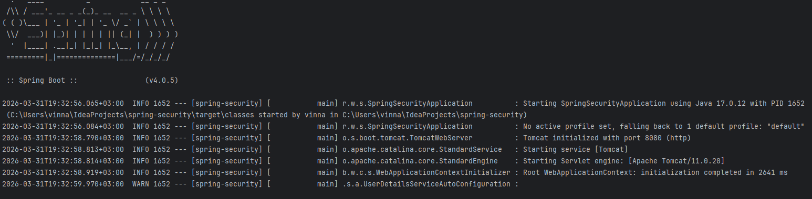](https://github.com/winnca/java/blob/spring_security/README/img.png)
     
    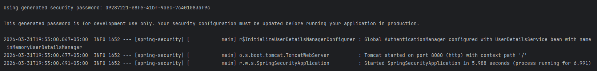

    
website

     
    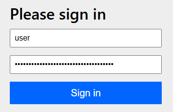
     
    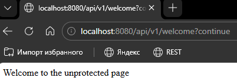
     
    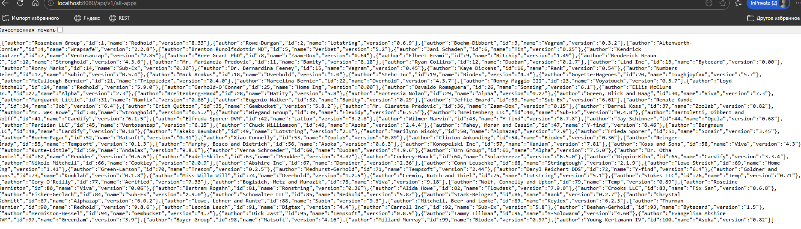
     
    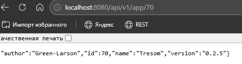

 
 

---

## <a id="title22">Практика-часть-2: настройка логина и пароля.</a>

 

## Настройка логина и пароля через application.yaml.

7. В `application.yaml` прописываем имя пользователя и пароль (любой).

    
login and password

     

    spring:
        security:
            user:
                name: winnca
                password: winnca

8. Протестируем:

    
sign in

     
    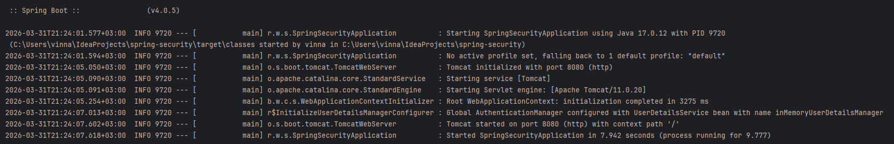
     
    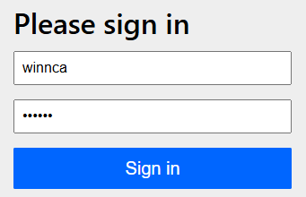
     
    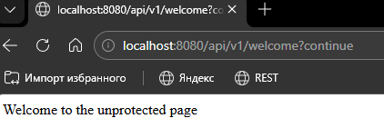
     
    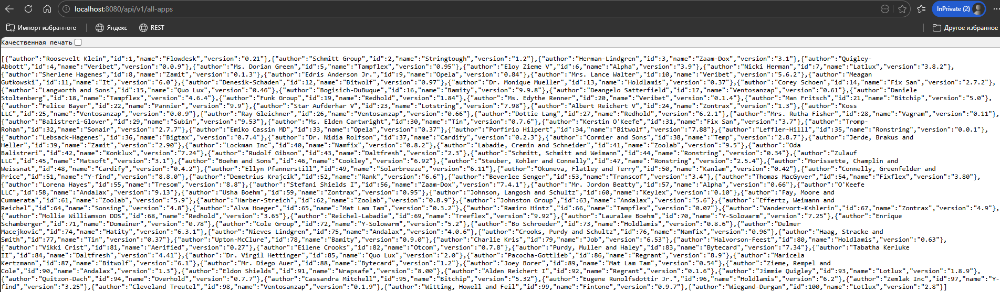
     
    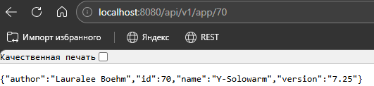

Вывод:

* нет случайного сгенерированного пароля, вошли под своим логином и пароль.

* такой подход допустим только в своих тестах и создаёт только 1 аккаунт, на деле в реальных приложениях и тестах не делают.

* правильно делать через `SecurityConfig`.

 

## Настройка логина и пароля через SecurityConfig

9. Создаём пакет `config` и класс `SecurityConfig`. 

* на класс добавим аннотации: `@Configuration` и `@EnableWebSecurity` = используются для настройки `Spring Security`.

* `@Configuration` является конфигурационным бином.

* `@EnableWebSecurity` применение глобальной web безопасности.

    
code-class

    
    package ru.winnca.spring_security.config;
    
    import org.springframework.context.annotation.Configuration;
    import org.springframework.security.config.annotation.web.configuration.EnableWebSecurity;
    
    @Configuration
    @EnableWebSecurity
    public class SecurityConfig {
    
    }

9.1. 2 метода: 1 - создаёт пользователя и сохранит в приложении, 2 - возвращает объект, который является кодировщиком паролей и выполняет хэширование алгоритмом `BCrypt`.

**Хеширование** — это необратимое преобразование пароля в строку фиксированной длины (хеш).

**Как это работает:**
1. При регистрации: пароль → хешируется → в БД сохраняется хеш.
2. При входе: введённый пароль → хешируется снова → сравнивается с хешем из БД.
3. Если хеши совпадают → пароль верный.

**Зачем это нужно:**
- При взломе БД злоумышленник получит хеши, а не реальные пароли.
- Подобрать исходный пароль по хешу очень сложно и долго.
- Алгоритм **BCrypt** специально сделан медленным — это усложняет перебор.

**Важно:** Пароль при входе не "передаётся в зашифрованном виде". `Spring Security` просто хеширует его и сравнивает с хешем из БД. Если пароль в БД хранится в открытом виде, а не хешированным — аутентификация не сработает, даже если пароли одинаковые.

9.2. 1 метод: используется интерфейс `UserDetailsService` = позволяет предоставить сведения о пользователе в контексте безопасности (имя, пароль, статус учётной записи, роли пользователя, ...).

  * принимает метод `PasswordEncoder` = интерфейс для одностороннего преобразования пароля. Для хранения пароля необходимо сравнивать с паролем предоставленным пользователем.

  * `UserDetails admin = User.builder().username("admin").password(encoder.encode("admin")).build();` = по такой схеме можно создавать сколько угодно пользователей. Пароль хэшируется.

  * Если пароль не хэшировать, тогда в бд будет обычным (пароль, приходящий от пользователя во время входа в систему, при сравнении с паролем из бд будут не совпадать, даже если они одинаковы в обычном виде) = (потому что пароль во время входа в систему передаётся в зашифрованном виде, а хранящийся в бд нет).
  
  * `InMemoryUserDetailsMananger` = класс для хранения и управления всеми пользователями. Под правильным логином и паролем сможем войти в систему. 

9.3. 2 метод: уже говорили. Дополним, что оба метода должны быть помечены аннотацией `@Bean`, чтобы находиться в контексте приложения.

    
code-method

    
    package ru.winnca.spring_security.config;
    
    import org.springframework.context.annotation.Bean;
    import org.springframework.context.annotation.Configuration;
    import org.springframework.security.config.annotation.web.configuration.EnableWebSecurity;
    import org.springframework.security.core.userdetails.User;
    import org.springframework.security.core.userdetails.UserDetails;
    import org.springframework.security.core.userdetails.UserDetailsService;
    import org.springframework.security.crypto.bcrypt.BCryptPasswordEncoder;
    import org.springframework.security.crypto.password.PasswordEncoder;
    import org.springframework.security.provisioning.InMemoryUserDetailsManager;
    
    @Configuration
    @EnableWebSecurity
    public class SecurityConfig {
        @Bean
        public UserDetailsService userDetailsService(PasswordEncoder encoder){
            UserDetails admin = User.builder().username("admin").password(encoder.encode("admin")).build();
            UserDetails user = User.builder().username("user").password("user").build();
            UserDetails alex = User.builder().username("alex").password(encoder.encode("alex")).build();
            
            return new InMemoryUserDetailsManager(admin, user, alex);
        }
    
        @Bean
        public PasswordEncoder passwordEncoder(){
            return new BCryptPasswordEncoder();
        }
    }

10. Удалим данные из `apllication.yaml` по созданию пользователя. Перезапустим приложение. Протестируем.

  
architecture

   
  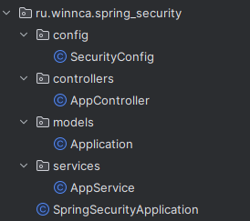

  
sign in alex

   
  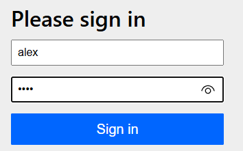
   
  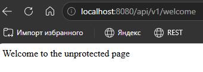
   
  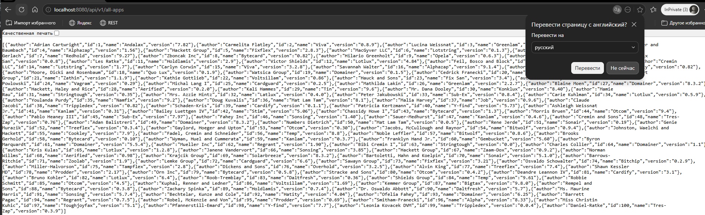
   
  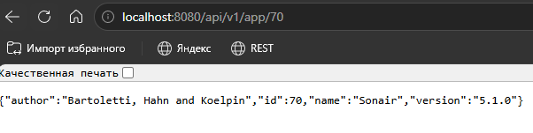

  
sign in admin

   
  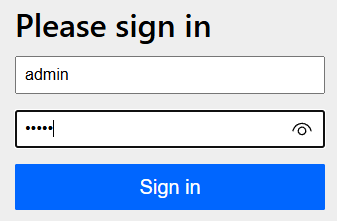
   
  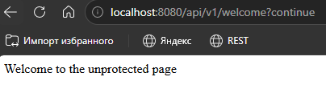
   
  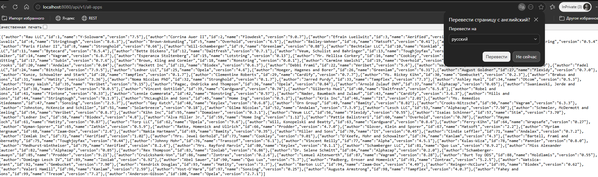
   
  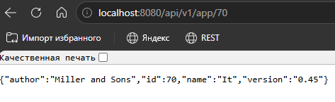

  
sign in user

   
  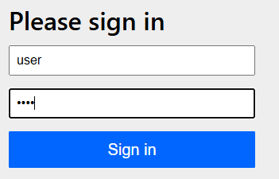
   
  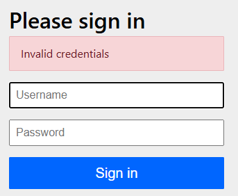
   
  Исправим на: UserDetails user = User.builder().username("user").password(encoder.encode("user")).build();
   
  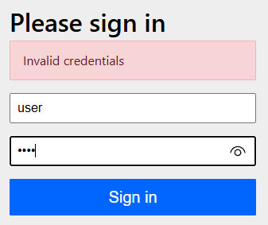
   
  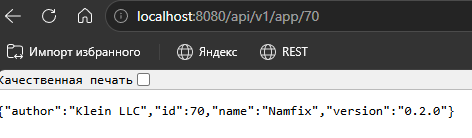
   
  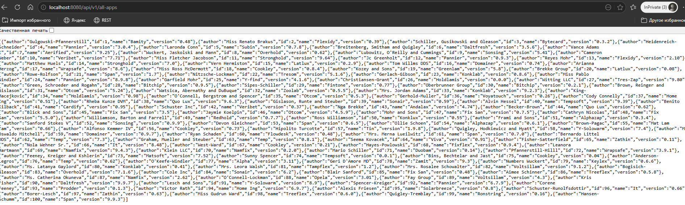

### Замечание:

* Но, что если хотим сделать доступ в контрольную точку всем пользователям (зарегистрированным и нет).

 
 

---

## <a id="title23">Практика-часть-3: права доступа к ресурсу</a>

 

## Настройка SpringFilterChain

11. Создадим 3-ий метод в конфигурационном классе.

* `SecurityFilterChain` = интерфейс для создания фильтра. В параметрах принимает `HttpSecurity` = позволяет конфигугрировать аутентификацию и авторизацию запросов. Пометим аннотации `@Bean`.

  
3 method

   
  
    @Bean
    public SecurityFilterChain securityFilterChain(HttpSecurity http) throws Exception{
        return http.csrf(AbstractHttpConfigurer::disable).
                authorizeHttpRequests(auth -> auth.requestMatchers("/api/v1/welcome").permitAll().
                        requestMatchers("/api/v1/**").authenticated()).
                formLogin(AbstractAuthenticationFilterConfigurer::permitAll).build();
    }

### Что такое CSRF (Cross-Site Request Forgery)?

Это тип атаки, при котором злоумышленник заставляет пользователя невольно выполнить действие на сайте, где тот уже авторизован.

**Как происходит атака:**

1. Вы входите в интернет-банк (`bank.com`) — браузер сохраняет куку.

2. Не выходя из банка, вы переходите на вредоносный сайт (`ev.com`).

3. Сайт `ev.com` отправляет скрытый запрос на `bank.com/transfer?to=hacker&amount=1000`.

4. Браузер автоматически прикрепляет к запросу куку от `bank.com`.

5. Сервер банка думает, что запрос от вас, и переводит деньги.

**Как защищает Spring Security (CSRF-токен):**

- Сервер генерирует уникальный случайный токен для каждой формы.

- Токен встраивается в страницу (например, в скрытое поле).

- При отправке формы токен отправляется обратно.

- Сервер проверяет токен. Если его нет или он неверный → запрос отклоняется.

**Почему в нашем проекте мы отключаем CSRF (`.csrf(AbstractHttpConfigurer::disable)`)?**

- Мы используем `stateless` `REST API` (без сессий и кук).

- В такой архитектуре `CSRF`-атаки не актуальны.

- **Предупреждение:** В приложениях с формами входа (``Thymeleaf`) отключать `CSRF` нельзя!

Реализация метода:

a. В нём отключаем `CSRF` защиту. Допустимо, где нет кук/сессий/браузеров. Нельзя при использовании приложений с формами (например, интернет-банк) и сессиями для аутентификации.

b. Впускает всех по адресу: `"/api/v1/welcome"`.

c. По остальным адресам впускает только авторизированных пользователей.

d. Все желающие могут авторизироваться: `.formLogin(AbstractAuthenticationFilterConfigurer::permitAll)`:

   * включает стандартную страницу логина `Spring Security`.

   * `permitAll()` - разрешает ВСЕМ доступ к странице логина.

12. Перезапустим приложение и протестируем.

  
sign in

   
  
   
  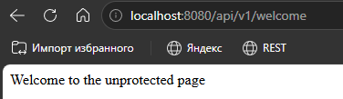
   
  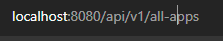
   
  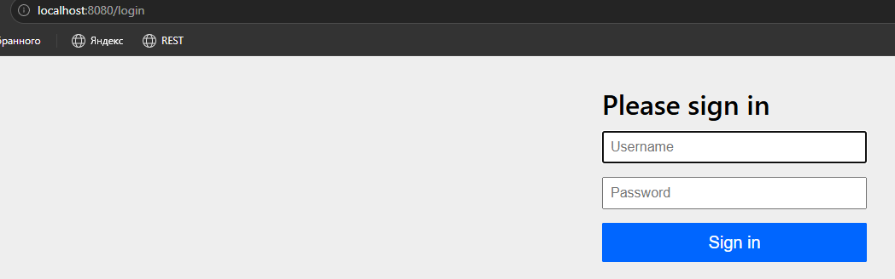
   
  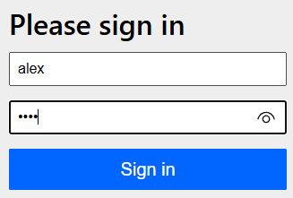
   
  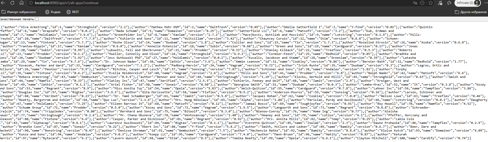

### Замечание:

* Что если надо дать доступ к конкретным контрольным точкам людям с определёнными правами.

 

## Доступ к endpoints пользователям с определёнными правами.

### Пояснение про `@PreAuthorize`

Аннотация `@PreAuthorize` проверяет права доступа **перед** выполнением метода.

| Синтаксис | Что проверяет | Пример |
|-----------|---------------|--------|
| `hasAuthority('ROLE_ADMIN')` | Есть ли у пользователя конкретное право | `@PreAuthorize("hasAuthority('ROLE_ADMIN')")` |
| `hasRole('ADMIN')` | То же самое, но префикс `ROLE_` добавляется автоматически | `@PreAuthorize("hasRole('ADMIN')")` |

**В вашем коде:**

- `hasAuthority('ROLE_ADMIN')` и `hasAuthority('ROLE_USER')` — проверяют конкретные права.

- `hasAuthority('ROLE_ADMIN')` — доступ только у ADMIN.

13. Добавим роли в классе `SecurityConfig`:

  
1 method

  
    @Bean
    public UserDetailsService userDetailsService(PasswordEncoder encoder){
        UserDetails admin = User.builder().username("admin").password(encoder.encode("admin")).roles("ADMIN").build();
        UserDetails user = User.builder().username("user").password(encoder.encode("user")).roles("USER").build();
        UserDetails alex = User.builder().username("alex").password(encoder.encode("alex")).roles("USER", "ADMIN").build();
        return new InMemoryUserDetailsManager(admin, user, alex);
    }

14. Чтобы авторизация обрабатывала роли на уровне метода, добавим на класс `SecurityConfig` аннотацию `@EnableMethodSecurity`:

  
class SecurityConfig

    @Configuration
    @EnableWebSecurity
    @EnableMethodSecurity

15. Добавим на контрольные точки проверки прав доступа:

  

    
    package ru.winnca.spring_security.controllers;
    
    import lombok.AllArgsConstructor;
    import org.springframework.security.access.prepost.PreAuthorize;
    import org.springframework.web.bind.annotation.GetMapping;
    import org.springframework.web.bind.annotation.PathVariable;
    import org.springframework.web.bind.annotation.RequestMapping;
    import org.springframework.web.bind.annotation.RestController;
    import ru.winnca.spring_security.models.Application;
    import ru.winnca.spring_security.services.AppService;
    
    import java.util.List;
    
    @RestController
    @AllArgsConstructor
    @RequestMapping("api/v1")
    public class AppController {
        private AppService service;
    
        @GetMapping("/welcome")
        public String welcome(){
            return "Welcome to the unprotected page";
        }
    
        @GetMapping("/all-apps")
        @PreAuthorize("hasAuthority('ROLE_USER')")
        public List<Application> allApplications(){
            return service.allApplications();
        }
    
        @GetMapping("/app/{id}")
        @PreAuthorize("hasAuthority('ROLE_ADMIN')")
        public Application applicationById(@PathVariable int id){
            return service.applicationById(id);
        }
    }

16. Протестируем. Зайдя под `user` будет доступно только просмотр всех приложений. Зайдя под `admin` просмотр приложения по идентификатору. Зайдя под `alex` будут доступны оба способа.

  
sign in user

   
  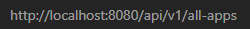
   
  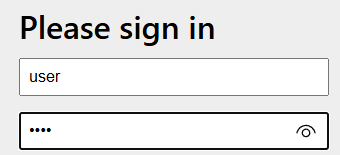
   
  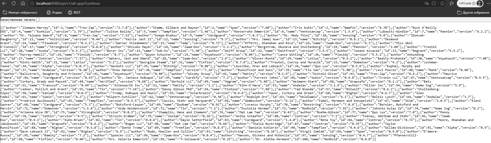
   
  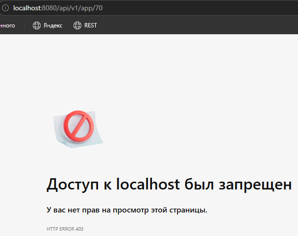

  
sign in admin

   
  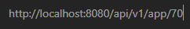
   
  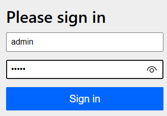
   
  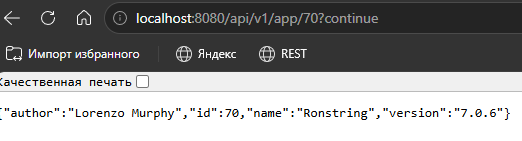
   
  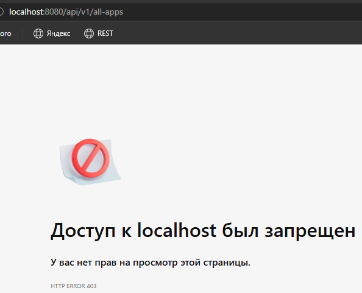

  
sign in alex

   
  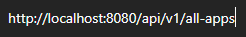
   
  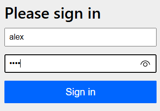
   
  
   
  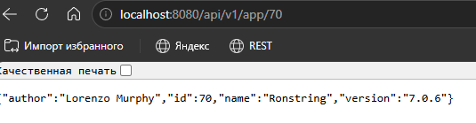

 
 

---

## <a id="title24">Практика-часть-4: создаём своих пользователей</a>

#### Создание своих пользователей через отдельный контроллер, а не напрямую через  `UserDetailsService`.

17. Подключим `Spring Data Jpa`:

### Spring Data JPA и Hibernate

**JPA (Java Persistence API)** — это спецификация (набор интерфейсов и правил). Она описывает, как Java-объекты должны отображаться на таблицы базы данных. Сама JPA не содержит реализации — это только стандарт.

**Hibernate** — это самая популярная реализация спецификации JPA (ORM-фреймворк). Он выполняет низкоуровневую работу:

- Преобразует Java-классы (с аннотацией `@Entity`) в таблицы базы данных.

- Преобразует вызовы методов (`repository.save(user)`) в SQL-запросы (`INSERT INTO users...`).

- Преобразует результаты SQL-запросов обратно в Java-объекты.

**Зачем это нужно:** Вы пишете код на Java, а Hibernate сам переводит его в SQL. Это ускоряет разработку и упрощает смену базы данных.

  
dependency

  
    <dependency>
        <groupId>org.springframework.boot</groupId>
        <artifactId>spring-boot-starter-data-jpa</artifactId>
    </dependency>

18. Подключим драйвер для взаимодействия с бд:

  
dependency

  
    <dependency>
        <groupId>org.postgresql</groupId>
        <artifactId>postgresql</artifactId>
    </dependency>

19. Создадим в `models` класс `MyUser`:

* `@Entity` = указывает, что класс является JPA-сущностью и будет отображён на таблицу в БД.

* `@Table(name="users")` = задаёт имя таблицы в базе данных (по умолчанию использовалось бы имя класса).

* `@Id` = обозначает первичный ключ.

* `@GeneratedValue(strategy = GenerationType.IDENTITY)` = указывает, что значение `ID` генерируется базой данных (автоинкремент).

* `@Column(unique = true)` = устанавливает уникальное ограничение на колонку `username` в БД.

  
models.MyUser

    package ru.winnca.spring_security.models;
    
    import jakarta.persistence.*;
    import lombok.Data;
    
    @Data
    @Entity
    @Table(name="users")
    public class MyUser {
        @Id
        @GeneratedValue(strategy = GenerationType.IDENTITY)
        private int id;
        @Column(unique = true)
        private String username;
        private String password;
        private String roles;
    }

20. Открываем `application.yaml`. Прописываем подключение к бд.

* `url` — строка подключения к базе данных:
  
  * `jdbc:postgresql://` — протокол = JDBC для PostgreSQL.

  * `localhost` — хост = где запущена БД.

  * `5432` — порт = стандартный для PostgreSQL.

  * `spring_security_db` — имя базы данных.

* `driver-class-name` — указывает полное имя класса `JDBC-драйвера`. `Spring Boot` может определить его автоматически по `URL`, но явное указание повышает надёжность.

* `username` — имя пользователя для подключения к `PostgreSQL`.

* `password` — пароль пользователя `PostgreSQL`.

* `ddl-auto: update` — политика управления схемой базы данных = обновляет схему без удаления данных (добавляет новые колонки/таблицы).

  
application.yaml

    spring:
        datasource:
            driver-class-name: org.postgresql.Driver
            url: jdbc:postgresql://localhost:5432/spring_security_db
            username: postgres
            password: 12345678
        jpa:
          hibernate:
            ddl-auto: update

#### Замечание: обязательно создайте бд spring_security_db в PostgreSQL.

21. Создаем репозиторий, который будет взаимодействовать с бд (интерфейс):

* Наследуемся от `JpaRepository` — интерфейс из `Spring Data JPA`, который предоставляет готовый набор методов для выполнения `CRUD-операций` и работы с базой данных.

* В совокупности дают большую часть реализации наших `CRUD-операций`, кроме чтения по имени пользователя.

* Используем `Optional`, чтобы явно указать, что "этот метод может не вернуть пользователя".

  
repository.UserRepository

    
    package ru.winnca.spring_security.repository;
    
    import org.springframework.data.jpa.repository.JpaRepository;
    import ru.winnca.spring_security.models.MyUser;
    
    import java.util.Optional;
    
    public interface UserRepository extends JpaRepository<MyUser, Long> {
          Optional<MyUser> readByUsername(String username);
    }

22. Создание класса `MyUserDeatilsService`, который имплементирует интерфейс `UserDeatilsService`.

  
services.MyUserDetailsService

    package ru.winnca.spring_security.services;
    
    import org.springframework.security.core.userdetails.UserDetails;
    import org.springframework.security.core.userdetails.UserDetailsService;
    import org.springframework.security.core.userdetails.UsernameNotFoundException;
    
    public class MyUserDetailsService implements UserDetailsService {
      @Override
      public UserDetails loadUserByUsername(String username) throws UsernameNotFoundException {
        return null;
      }
    }

#### Замечание: видим, что возвращает данный метод UserDetails, подходящего класса нет, поэтому надо сделать собственную реализацию этого интерфейса.

23. Создание класса `MyUserDetails`, который имплементирует интерфейс `UserDetails`.

  
config.MyUserDetails

    
    package ru.winnca.spring_security.config;
    
    import org.jspecify.annotations.Nullable;
    import org.springframework.security.core.GrantedAuthority;
    import org.springframework.security.core.userdetails.UserDetails;
    
    import java.util.Collection;
    
    public class MyUserDetails implements UserDetails {
        @Override
        public Collection<? extends GrantedAuthority> getAuthorities() {
            return null;
        }
    
        @Override
        public @Nullable String getPassword() {
            return null;
        }
    
        @Override
        public String getUsername() {
            return null;
        }
    
        @Override
        public boolean isAccountNonExpired() {
            return UserDetails.super.isAccountNonExpired();
        }
    
        @Override
        public boolean isAccountNonLocked() {
            return UserDetails.super.isAccountNonLocked();
        }
    
        @Override
        public boolean isCredentialsNonExpired() {
            return UserDetails.super.isCredentialsNonExpired();
        }
    
        @Override
        public boolean isEnabled() {
            return UserDetails.super.isEnabled();
        }
    }

24. Реализация методов класса `MyUserDetails`:

24.1. Чтобы получить все эти данные для переопределённых методов, самый простой способ это в конструкторе принимать пользователя.

  
code

  
    private MyUser user;

    public MyUserDetails(MyUser user){
        this.user=user;
    }

24.2. Роли хранятся в строковом экземпляре и должны возвращаться в какой-то коллекции, поэтому используем Arrays.stream. Тип данных, который должен храниться в коллекции обязан наследоваться от `GrantedAuthority` и тогда, к примеру, возьмём `SimpleGrantedAuthority` = сериализуется и у него есть поле роль, создаём объект этого класса.

  
getAuthorities()

    @Override
    public Collection<? extends GrantedAuthority> getAuthorities() {
        return Arrays.stream(user.getRoles().split(", ")).map(SimpleGrantedAuthority::new).collect(Collectors.toList());
    }

Благодаря этой записи:
* сплитим строку в роли на отдельные кусочки
* преобразуем строковое значение в нужный класс 
* собираем все роли в лист
* return полномочия пользователя

24.3. Пароль и логин возьмём у пользователя через геттер.

  
getPassword() && getUsername()

  
    @Override
    public @Nullable String getPassword() {
        return user.getPassword();
    }
    
    @Override
    public String getUsername() {
        return user.getUsername();
    }

24.4. `isAccountNotExpired()` = указывает истёк ли срок действия учётной записи пользователя (то есть истёкшая не может быть аутентифицирована): `true` = действительна, `false` = нет.

  
isAccountNonExpired()

    @Override
    public boolean isAccountNonExpired() {
        return true;
    }

24.5. `isAccountNotLocked()` = указывает заблочена ли учётная запись: `true` = незаблокирована, `false` = ...

  
isAccountNotLocked()

    
    @Override
    public boolean isAccountNonLocked() {
        return true;
    }

24.6. `isCredentialNotExpired()` = указывает истёк ли срок действия пароля (просроченные аутентификации не подлежат): `true` = действительна, `false` = нет.

  
isCredentialNotExpired()

    
    @Override
    public boolean isCredentialsNonExpired() {
        return true;
    }

24.7. `isEnabled()` = включён ли пользователь или нет: `true` = да, `false` = нет.

  
isEnabled()

    @Override
    public boolean isEnabled() {
        return true;
    }

24.8. Полный код класса:

  
config.MyUserDetails

    
    package ru.winnca.spring_security.config;
    
    import org.jspecify.annotations.Nullable;
    import org.springframework.security.core.GrantedAuthority;
    import org.springframework.security.core.authority.SimpleGrantedAuthority;
    import org.springframework.security.core.userdetails.UserDetails;
    import ru.winnca.spring_security.models.MyUser;
    
    import java.util.Arrays;
    import java.util.Collection;
    import java.util.stream.Collectors;
    
    public class MyUserDetails implements UserDetails {
    
        private MyUser user;
    
        public MyUserDetails(MyUser user){
            this.user=user;
        }
    
        @Override
        public Collection<? extends GrantedAuthority> getAuthorities() {
            return Arrays.stream(user.getRoles().split(", ")).map(SimpleGrantedAuthority::new).collect(Collectors.toList());
        }
    
        @Override
        public @Nullable String getPassword() {
            return user.getPassword();
        }
    
        @Override
        public String getUsername() {
            return user.getUsername();
        }
    
        @Override
        public boolean isAccountNonExpired() {
            return true;
        }
    
        @Override
        public boolean isAccountNonLocked() {
            return true;
        }
    
        @Override
        public boolean isCredentialsNonExpired() {
            return true;
        }
    
        @Override
        public boolean isEnabled() {
            return true;
        }
    }

25. Реализуем метод `loadUserByUsername()` из класса `MyUserDetailsService`:

  
services.MyUserDetailsService

    package ru.winnca.spring_security.services;
    
    import org.springframework.beans.factory.annotation.Autowired;
    import org.springframework.security.core.userdetails.UserDetails;
    import org.springframework.security.core.userdetails.UserDetailsService;
    import org.springframework.security.core.userdetails.UsernameNotFoundException;
    import org.springframework.stereotype.Service;
    import ru.winnca.spring_security.config.MyUserDetails;
    import ru.winnca.spring_security.models.MyUser;
    import ru.winnca.spring_security.repository.UserRepository;
    
    import java.util.Optional;
    
    @Service
    public class MyUserDetailsService implements UserDetailsService {
    
        @Autowired
        private UserRepository repository;
        @Override
        public UserDetails loadUserByUsername(String username) throws UsernameNotFoundException {
            Optional<MyUser> user = repository.readByUsername(username);
            return user.map(MyUserDetails::new).orElseThrow(()->new UsernameNotFoundException(username + "not found"));
        }
    }

26. Теперь вместо создания вручную через `@Builder` в классе `SecurityConfig` возвращает объект `MyUserDetailsService()`:

  
config.SecurityConfig

        @Bean
        public UserDetailsService userDetailsService(PasswordEncoder encoder){
        //        UserDetails admin = User.builder().username("admin").password(encoder.encode("admin")).roles("ADMIN").build();
        //        UserDetails user = User.builder().username("user").password(encoder.encode("user")).roles("USER").build();
        //        UserDetails alex = User.builder().username("alex").password(encoder.encode("alex")).roles("USER", "ADMIN").build();
        //        return new InMemoryUserDetailsManager(admin, user, alex);
            return new MyUserDetailsService();
        }

26. Создаём контрольную точку для создания пользователей.

  
controllers.AppController

    @PostMapping("/new-user")
    public String addUser(@RequestBody MyUser user){
        service.addUser(user);
        return "user saved";
    }

27. Для сервиса добавим аннотацию `@AllArgsConstructor`, чтобы внедрила репозиторий. Здесь же добавим метод по добавлению пользователя.

  
services.AppService

        public void addUser(MyUser user){
            repository.save(user);
        }

28. Сделаем так, чтобы пользователя могли создать все:

  
config.SecurityConfig

        @Bean
        public SecurityFilterChain securityFilterChain(HttpSecurity http) throws Exception{
            return http.csrf(AbstractHttpConfigurer::disable).
                    authorizeHttpRequests(auth -> auth.requestMatchers("/api/v1/welcome", "/api/v1/new-user").permitAll().
                            requestMatchers("/api/v1/**").authenticated()).
                    formLogin(AbstractAuthenticationFilterConfigurer::permitAll).build();
        }

 
 

---

## <a id="title25">Практика-часть-5: добавление аутентификации</a>

### Разница между идентификацией, аутентификацией и авторизацией

| Термин | Что делает | Вопрос |
|--------|------------|--------|
| **Идентификация** | Пользователь вводит логин (называет себя) | "Кто вы?" |
| **Аутентификация** | Система проверяет, правильный ли пароль введён для этого логина | "Пароль верен?" |
| **Авторизация** | Система проверяет, есть ли у пользователя права на действие | "Что вам разрешено?" |

### Процесс входа в систему (по шагам):

1. **Идентификация:** пользователь вводит логин `"admin"`

2. **Аутентификация:** система проверяет пароль для `"admin"` — правильный?

3. **Авторизация:** система проверяет, есть ли у `"admin"` права доступа к той или иной странице

### Про `AuthenticationProvider`

**`AuthenticationProvider`** — это компонент, который **выполняет аутентификацию** (проверяет логин и пароль).

`DaoAuthenticationProvider` — стандартная реализация, которая:

- использует `UserDetailsService` (чтобы найти пользователя по логину);

- использует `PasswordEncoder` (чтобы проверить пароль).

Без `AuthenticationProvider` вы не сможете войти в систему под пользователями, созданными через вашу БД.

29. В `SecurityConfig` создаём ещё один метод: `authenticationProvider()`:

* Создадим экземпляр `DAO` этого провайдера, то есть создадим экземпляр класса `DaoAuthenticationProvider` = реализация провайдера, которая реализует `UserDetailsService` и `PasswordEncoder` для аутентификации имени пользователя и пароля

* Из метода `userDetailsService()` можем удалить параметры, нет в них необходимости.

  
config.SecurityConfig

    
    @Bean
    public UserDetailsService userDetailsService(){
    //        UserDetails admin = User.builder().username("admin").password(encoder.encode("admin")).roles("ADMIN").build();
    //        UserDetails user = User.builder().username("user").password(encoder.encode("user")).roles("USER").build();
    //        UserDetails alex = User.builder().username("alex").password(encoder.encode("alex")).roles("USER", "ADMIN").build();
    //        return new InMemoryUserDetailsManager(admin, user, alex);
        return new MyUserDetailsService();
    }
    @Bean
    public AuthenticationProvider authenticationProvider(){
        DaoAuthenticationProvider provider = new DaoAuthenticationProvider(userDetailsService());
        provider.setPasswordEncoder(passwordEncoder());
        return provider;
    }

30. Прежде, чем пользователя сохранять. Нужно захэшировать пароль:

  
services.AppService

    public void addUser(MyUser user){
        user.setPassword(passwordEncoder.encode(user.getPassword()));
        repository.save(user);
    }

31. Протестируем приложение с помощью Postman (не забудьте открыть pgAdmin4 и создать бд).

  
Postman: sign up

  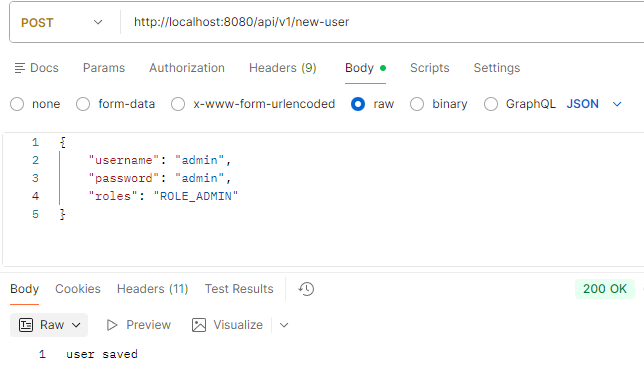
   
  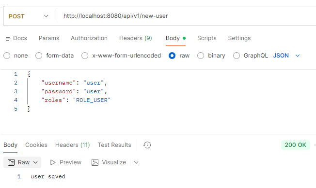
   
  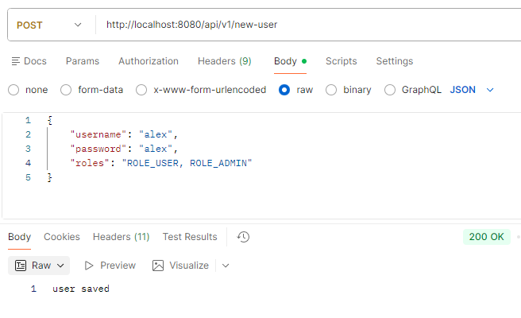

  
PostgreSQL

   
  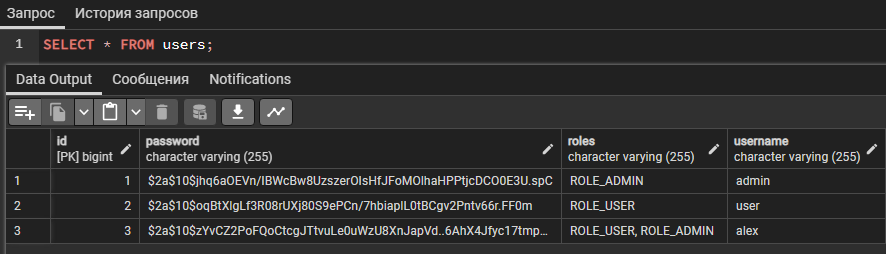

  
sign in user

   
  
   
  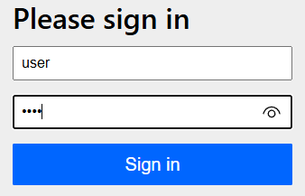
   
  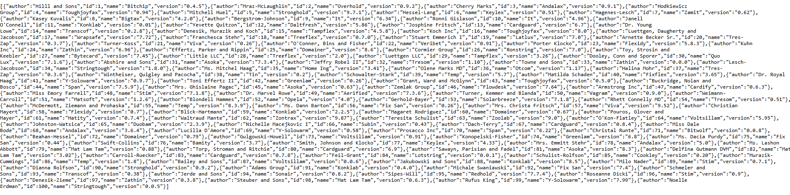
   
  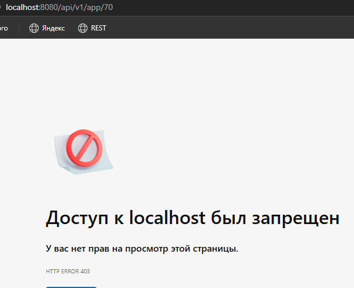

  
sign in admin

   
  
   
  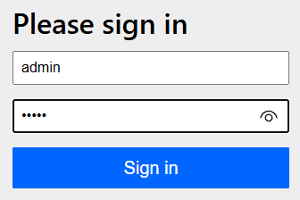
   
  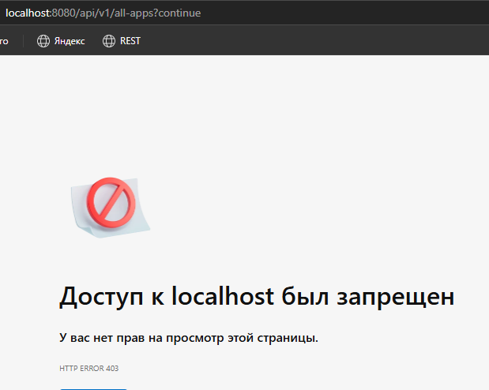
   
  

  
sign in alex

  
   
  
   
  
   
  

